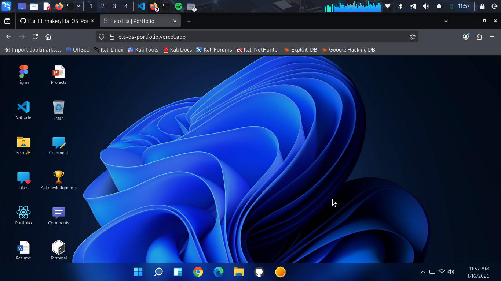

# Ela-OS Portfolio

[](https://opensource.org/licenses/MIT)
[](https://nextjs.org/)
[](https://www.typescriptlang.org/)
[](https://reactjs.org/)

An interactive portfolio website that emulates a desktop operating system experience. Built with Next.js, Redux, and styled-components, featuring draggable windows, dynamic widgets, and a comprehensive showcase of projects and articles.

 <!-- Add a screenshot image to public/assets/ -->

## 🌟 Live Demo

[Visit Ela-OS Portfolio](https://www.feloela.com/)

## ✨ Features

- **Desktop OS Simulation**: Full desktop experience with windows, taskbar, start menu, system tray, and widgets
- **Interactive UI**: Draggable and resizable windows, context menus, and keyboard navigation
- **Portfolio Showcase**: Highlighted projects, articles feed, resume, and contact information
- **Dynamic Widgets**: Weather, news, calendar, todo list, and more
- **Responsive Design**: Optimized for desktop and mobile devices
- **Accessibility**: Keyboard-friendly interactions and screen reader support
- **Backend Integration**: API endpoints for comments, likes, and contact forms
- **Component Library**: Storybook-powered reusable components
- **Testing Suite**: Comprehensive unit and integration tests with Jest

## 🛠️ Tech Stack

### Frontend

- **Framework**: Next.js 15 (Pages Router)
- **Language**: TypeScript
- **State Management**: Redux with Redux Thunk
- **Styling**: styled-components
- **Animations**: Framer Motion
- **Icons**: React Icons
- **Forms**: Formik with Yup validation
- **Calendar**: React Calendar
- **Terminal**: Terminal in React

### Backend

- **Runtime**: Node.js
- **Database**: MongoDB with Mongoose
- **API**: Next.js API Routes with next-connect
- **Email**: SendGrid
- **HTTP Client**: Axios

### Development & Testing

- **Testing**: Jest with React Testing Library
- **Linting**: ESLint
- **Storybook**: Component development and documentation
- **Git Hooks**: Husky with lint-staged
- **Commit Convention**: Commitizen

## 🚀 Getting Started

### Prerequisites

- Node.js (v18 or higher)
- npm or yarn
- MongoDB (for backend features)

### Installation

1. **Clone the repository**

   ```bash
   git clone https://github.com/feloela/ela-os-portfolio.git
   cd ela-os-portfolio
   ```

2. **Install dependencies**

   ```bash
   npm install
   ```

3. **Environment Setup**
   Create a `.env.local` file in the root directory and add your environment variables:

   ```env
   MONGODB_URI=your_mongodb_connection_string
   SENDGRID_API_KEY=your_sendgrid_api_key
   EMAIL_FROM=your_email@example.com
   ```

4. **Run the development server**
   ```bash
   npm run dev
   ```
   Open [http://localhost:8888](http://localhost:8888) in your browser.

### Build for Production

```bash
npm run build
npm run start
```

## 📜 Available Scripts

- `npm run dev` - Start development server on port 8888
- `npm run build` - Create production build
- `npm run start` - Start production server
- `npm run lint` - Lint source files
- `npm run test` - Run Jest tests
- `npm run test:watch` - Run tests in watch mode
- `npm run test:coverage` - Generate test coverage report
- `npm run storybook` - Start Storybook development server
- `npm run tsc` - Run TypeScript compiler check

## 📁 Project Structure

```
ela-os-portfolio/
├── backend/                 # Backend API logic
│   ├── config/             # Database and helpers
│   ├── controllers/        # API controllers
│   └── models/             # MongoDB models
├── components/             # React components
│   ├── About/              # About section components
│   ├── Desktop/            # Desktop UI components
│   ├── Widgets/            # Dynamic widgets
│   └── ...                 # Other components
├── design-system/          # Design tokens and global styles
├── hooks/                  # Custom React hooks
├── pages/                  # Next.js pages and API routes
│   ├── api/                # API endpoints
│   └── _app.tsx            # App component
├── public/                 # Static assets
├── store/                  # Redux store configuration
├── test/                   # Test utilities
├── types/                  # TypeScript type definitions
└── utils/                  # Utility functions
```

## 🤝 Contributing

Contributions are welcome! Please follow these steps:

1. Fork the repository
2. Create a feature branch: `git checkout -b feature/your-feature-name`
3. Commit your changes: `npm run cm` (uses Commitizen)
4. Push to the branch: `git push origin feature/your-feature-name`
5. Open a Pull Request

### Development Guidelines

- Follow the existing code style
- Write tests for new features
- Update documentation as needed
- Ensure all tests pass before submitting

## 📄 License

This project is licensed under the MIT License - see the [LICENSE](LICENSE) file for details.

## 🙏 Acknowledgments

- Inspired by modern desktop operating systems
- Built with love for showcasing creative portfolios
- Thanks to the open-source community for amazing tools

## 📞 Contact

- **Website**: [feloela](https://www.portfolio.felixeladi.co.ke)
- **GitHub**: [@Ela-El-maker](https://github.com/Ela-El-maker)
- **LinkedIn**: [Felo Ela](https://www.linkedin.com/in/felixeladi/)

---

Made with ❤️ by Ela-El-maker
